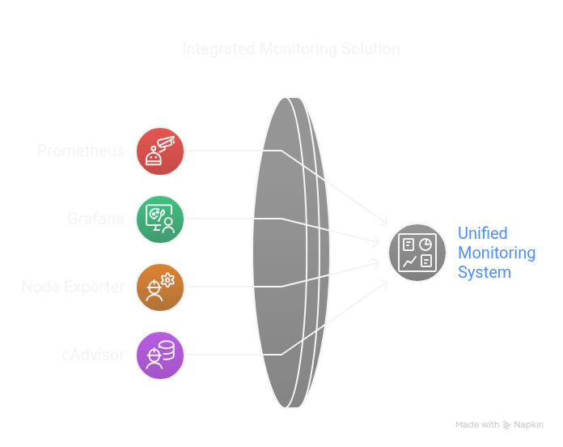

# Prometheus-Grafana Monitoring Project

This project sets up a monitoring stack using **Prometheus** for collecting metrics and **Grafana** for visualizing them. It also includes **Node Exporter** to monitor host system metrics and **cAdvisor** (optional) to monitor container metrics.

---
## Overview


---

## Table of Contents

1. [Overview](#overview)
2. [Prerequisites](#prerequisites)
3. [Project Structure](#project-structure)
4. [Setup Instructions](#setup-instructions)
   - [Step 1: Clone the Repository](#step-1-clone-the-repository)
   - [Step 2: Configure Prometheus](#step-2-configure-prometheus)
   - [Step 3: Start the Services](#step-3-start-the-services)
5. [Accessing the Interfaces](#accessing-the-interfaces)
   - [Prometheus](#prometheus)
   - [Grafana](#grafana)
6. [Creating Dashboard Panels in Grafana](#creating-dashboard-panels-in-grafana)
   - [Step 1: Add Prometheus as a Data Source](#step-1-add-prometheus-as-a-data-source)
   - [Step 2: Create a New Dashboard](#step-2-create-a-new-dashboard)
   - [Step 3: Add Panels](#step-3-add-panels)
7. [Optional: Enable cAdvisor](#optional-enable-cadvisor)
8. [Troubleshooting](#troubleshooting)

---

## Overview

This repository provides a complete setup for monitoring system and container metrics using **Prometheus** and **Grafana**. The following components are included:
- **Prometheus**: Scrapes metrics from targets such as Node Exporter and cAdvisor.
- **Grafana**: Visualizes the scraped metrics in customizable dashboards.
- **Node Exporter**: Exposes host-level metrics like CPU, memory, disk usage, etc.
- **cAdvisor** (optional): Exposes container-level metrics like resource usage and performance.

---

## Prerequisites

Before you begin, ensure you have the following installed on your system:
- **Docker**: To run the containers.
- **Docker Compose**: To manage the multi-container setup.
- **Basic knowledge of Prometheus and Grafana**.

---

## Project Structure

The repository contains the following files:

- `docker-compose.yml`: Defines the services (Prometheus, Grafana, Node Exporter, and cAdvisor).
- `prometheus.yml`: Configuration file for Prometheus, specifying scrape targets and intervals.
- `README.md`: This documentation file.

---

## Setup Instructions

### Step 1: Clone the Repository

Clone this repository to your local machine:

```bash
git clone https://github.com/gideon-tee/prometheus-grafana-monitoring.git
cd prometheus-grafana-monitoring
```

---

### Step 2: Configure Prometheus

Edit the prometheus.yml file to match your environment

- Replace 192.168.36.59:9100 under the node_exporter job with the IP address and port of your Node Exporter instance.
- If you're enabling cAdvisor, ensure the cadvisor job points to the correct target (cadvisor:8080).

#### Example prometheus.yml
```yml
global:
  scrape_interval: 15s

scrape_configs:
  - job_name: 'prometheus'
    static_configs:
      - targets: ['localhost:9090'] # Prometheus itself

  - job_name: 'node_exporter'
    static_configs:
      - targets: ['192.168.36.59:9100'] # Replace with your Node Exporter IP

  - job_name: 'cadvisor'
    static_configs:
      - targets: ['cadvisor:8080'] # Uses Docker's internal DNS
```

### Step 3: Start the services

```bash
    docker-compose up -d
```
This will start the following containers:
- Prometheus : Scrapes metrics from targets.
- Grafana : Visualizes the metrics.
- Node Exporter : Collects host system metrics.
- cAdvisor (optional): Collects container metrics.

To verify that all services are running, use:
```bash
    docker ps
```

### Accessing the interfaces
Access the Prometheus web interface at:

`http://localhost:9090`

Access the Grafana web interface at:

`http://localhost:3000`

### Default login credentials

Username: `admin`

Password: `admin`

### Creating Dashboard Panels in Grafana
#### Step 1: Add Prometheus as a Data Source
- Navigate to Configuration > Data Sources in the Grafana sidebar.
- Click `Add data source` .
- Select `Prometheus` from the list.
- Configure the data source: `URL: http://prometheus:9090`
- Click Save & Test to verify the connection.

#### Step 2: Create a New Dashboard
- Click the + icon in the sidebar and select Dashboard .
- Click Add new panel to create your first visualization.

#### Step 3: Add Panels
- In the query editor, select the Prometheus data source.
- Use PromQL (Prometheus Query Language) to write queries. For example:
- CPU usage: rate(node_cpu_seconds_total[1m])
- Memory usage: node_memory_MemTotal_bytes - node_memory_MemFree_bytes
- Disk usage: node_filesystem_size_bytes - node_filesystem_free_bytes
- Customize the visualization type (e.g., graph, gauge, single stat).
- Save the dashboard when you're done.


### Troubleshooting
- Prometheus Targets Down : Ensure the node_exporter and cadvisor services are running and accessible.

- Grafana Login Issues : Reset the admin password using the Grafana CLI if needed.

- Missing Metrics : Verify that the prometheus.yml configuration matches your environment.